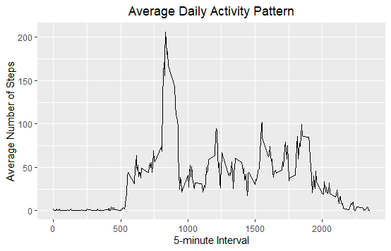
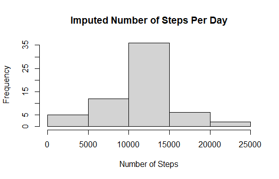

## Loading and preprocessing the data
activity = read.csv("C:/Users/ginna.robayo/Desktop/GINA PERSONAL/COURSERA/specdata/activity.csv")

## What is mean total number of steps taken per day?
total_of_steps_of_day <- sum(activity$steps, na.rm = TRUE)

## The total number of steps per day is:

570608

## Make a histogram of the total number of steps taken each day

* Calculating the total number of steps taken each day and stored in a variable

total_steps_per_day <- aggregate(steps~date, data=activity, FUN=sum, na.rm=TRUE)

* Generating the Histogram by each day

hist(total_steps_per_day$steps)

## Calculating the mean and median

total_steps_each_perday_median <- median(total_steps_per_day$steps)
* Median: 10765

total_steps_each_perday_mean <- mean(total_steps_per_day$steps)
* Mean: 10766.19

## What is the average daily activity pattern?
* Make a time-series plot of the 5-minute interval and the average number of steps taken, averaged acoss all days.

library(ggplot2)
meanStepsByInt <- aggregate(steps ~ interval, activity, mean)
ggplot(data = meanStepsByInt, aes(x = interval, y = steps)) + geom_line() + ggtitle("Average Daily Activity Pattern") + xlab("5-minute Interval") + ylab("Average Number of Steps") + theme(plot.title = element_text(hjust = 0.5))

* Which 5-minute interval across all days contain the maximum number of steps

maxInt <- meanStepsByInt[which.max(meanStepsByInt$steps),]

 Interval             steps

  104              835       206.1698

So, the 5-minute interval that contains the maximum number of steps ( 206.2 steps ) is the interval 835.

## Imputing missing values
 * Calculate and report the total number of missing values in the dataset

missingVals <- is.na(activity$steps)

There are 16568 missing values. I will replace these missing values with the 5-day average of that respective interval. 

* Create a new dataset that is equal to the original dataset but with the missing data filled in.

imp_activity <- transform(activity,steps = ifelse(is.na(activity$steps), meanStepsByInt$steps[match(activity$interval,meanStepsByInt$interval)],activity$steps))

- Make a histogram of the total number of steps taken each day, and report the mean and median.

impStepsByInt <- aggregate(steps ~ date, imp_activity, FUN=sum)
hist(impStepsByInt$steps,
     main = "Imputed Number of Steps Per Day",
     xlab = "Number of Steps")

library(Hmisc)
> imputing <- activity
> imputing$steps <- impute(activity$steps, total_steps_each_perday_median)
> sum(is.na(imputing$steps))

[1] 0

Make a histogram of the total number of steps taken each day and Calculate and report the mean and median total number of steps taken per day. Do these values differ from the estimates from the first part of the assignment? What is the impact of imputing missing data on the estimates of the total daily number of steps?

sumImputing <- aggregate(steps ~ date, imputing, sum)
> names(sumImputing)[1] = "date"
> names(sumImputing)[2] = "Imputedsteps"
> head(sumImputing, 20)
         date Imputedsteps
1  2012-10-01      3100320
2  2012-10-02          126
3  2012-10-03        11352
4  2012-10-04        12116
5  2012-10-05        13294
6  2012-10-06        15420
7  2012-10-07        11015
8  2012-10-08      3100320
9  2012-10-09        12811
10 2012-10-10         9900
11 2012-10-11        10304
12 2012-10-12        17382
13 2012-10-13        12426
14 2012-10-14        15098
15 2012-10-15        10139
16 2012-10-16        15084
17 2012-10-17        13452
18 2012-10-18        10056
19 2012-10-19        11829
20 2012-10-20        10395

library(ggplot2)
H2 <- ggplot(data = sumImputing, aes(x = Imputedsteps)) +
        geom_histogram(fill = "red", binwidth = 1000) +
        xlab("Total number of steps each day") +
        ylab("Frequency") +
        ggtitle("Histogram of the Total Number of Steps Taken Each Day")
print(H2)

