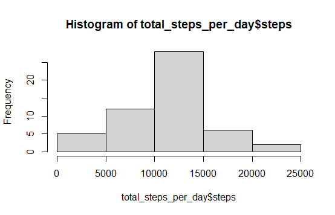

## Loading and preprocessing the data
activity = read.csv("C:/Users/ginna.robayo/Desktop/GINA PERSONAL/COURSERA/specdata/activity.csv")

## What is mean total number of steps taken per day?
total_of_steps_of_day <- sum(activity$steps, na.rm = TRUE)

## The total number of steps per day is:

570608

## Make a histogram of the total number of steps taken each day

* Calculating the total number of steps taken each day and stored in a variable

total_steps_per_day <- aggregate(steps~date, data=activity, FUN=sum, na.rm=TRUE)

* Generating the Histogram by each day

hist(total_steps_per_day$steps)

## Calculating the mean and median

> total_steps_each_perday_median <- median(total_steps_each_day$steps)
> total_steps_each_perday_mean <- mean(total_steps_each_day$steps)

